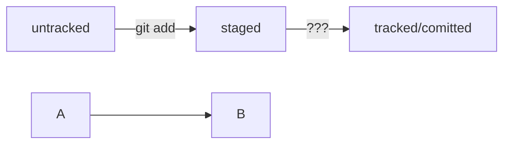

#### Изучаем markdown

Текст над 

---

Текст Под

---

*текст курсивом* 

**текст полужирным шрифтом**

~~Зачёркнутый текст.~~

1. Первый пункт нумерованного списка.
2. Второй пункт.

* первый пункт ненумерованного списка;
* второй пункт ненумерованного списка

[Github](https://www.github.com "github")

```bash
ls - la
```
```html
<h1>А я просто текст</h1>
```

```
let a = Math.PI
console.log(a)
```

